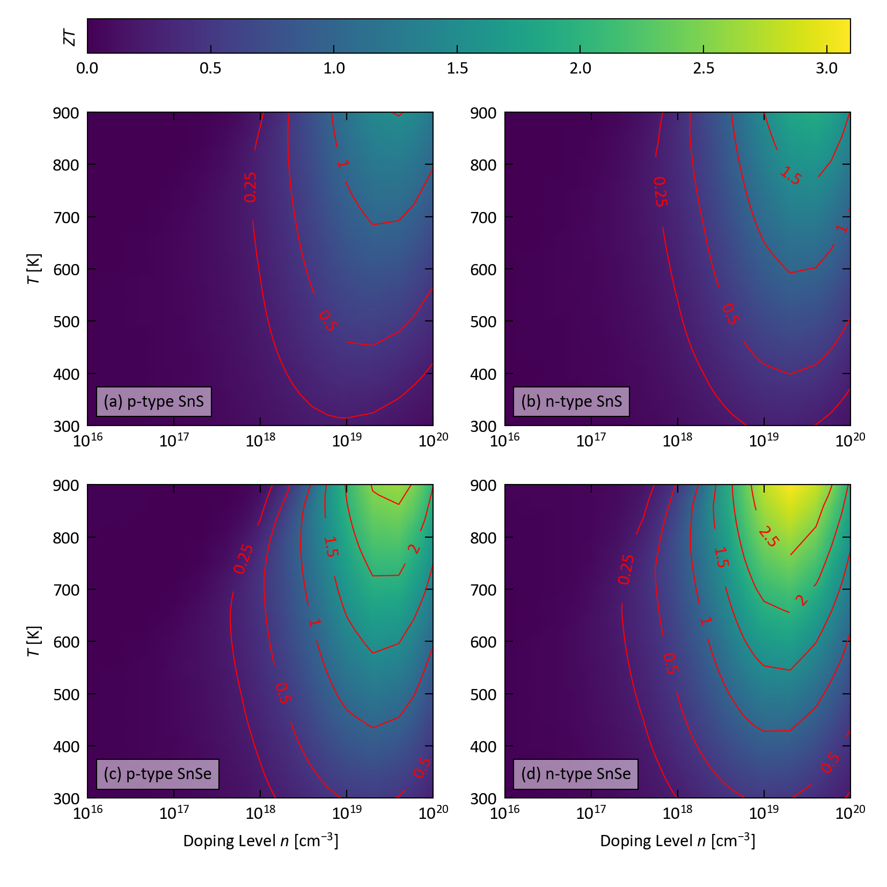

# SnS-SnSe-*ZT*


## Overview

This example analyses a *ZT* calculation on p- and n-type *Pnma* SnS and SnSe.


## Scripts

This example contains the following example scripts:

### 1. `zt_plot.py`

This script plots a comparison of the *ZT* of p- and n-type *Pnma* SnS and SnSe as a function of doping level *n* and temperature *T*.



### 2. `zt_max_yaml.py`

This script uses the analysis tools in `zt_calc_workflow` to extract the maximum <i>ZT</i><sub>max</sub> at temperatures around the *Pnma* -> *Cmcm* transition *T* and writes the data to a YAML file.

```yaml
- system: SnSe-Pnma
  carrier_type: p
  carrier_conc: 4e+19
  temp: 800.0
  sigma:
    xx: 595.042695
    yy: 364.83101600000003
    zz: 196.965215
    ave: 385.613008
  ...
  zt:
    xx: 0.8278741115290847
    yy: 2.8298428483414524
    zz: 2.745564301262727
    ave: 2.2751622078279023
```


## References

1. J. M. Skelton,
   "Approximate models for the lattice thermal conductivity of alloy thermoelectrics",
   *J. Mater. Chem. C* **9** (*35*), 11772 (**2021**), DOI: <a href="https://doi.org/10.1039/D1TC02026A" target="_blank">10.1039/D1TC02026A</a>
2. J. M. Flitcroft, I. Pallikara and J. M. Skelton,
   "Thermoelectric Properties of *Pnma* and Rocksalt SnS and SnSe",
   *Solids* **3** (*1*), 155-176 (**2022**), DOI: <a href="https://doi.org/10.3390/solids3010011" target="_blank">10.3390/solids3010011</a>
3. M. Zhang, J. Flictroft, S. Guillemot and J. Skelton,
   "Thermoelectric properties of *Pnma* and *R*3*m* GeS and GeSe"
   *J. Mater. Chem. C* **11**, 14833 (**2023**, DOI: <a href="https://doi.org/10.1039/D3TC02938G" target="_blank">10.1039/D3TC02938G</a>
