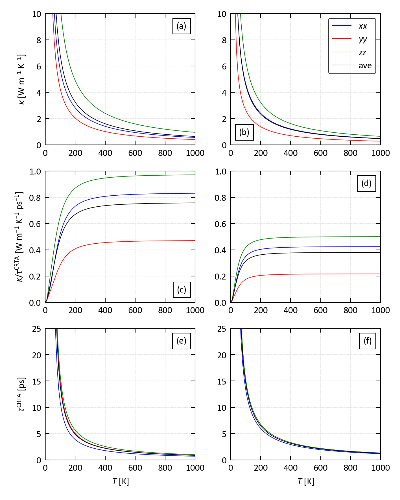

# SnS-SnSe-<i>&kappa;</i>latt

## Overview

This example analyses a lattice thermal conductivity ($\kappa_\mathrm{latt}$) calculation on *Pnma* SnS and SnSe.

## Scripts

This example contains the following example scripts:

### 1. `k_latt_crta_plot.py`

This script plots an analysis of the $\kappa_\mathrm{latt}$ of SnS and SnSe using the "constant relaxation-time approximation" ("CRTA") model, which decomposes the $\kappa$ into a harmonic function $\kappa / \tau^\mathrm{CRTA}$ and a weighted-average lifetime $\tau^\mathrm{CRTA}$.

## References

1. J. M. Skelton,
   "Approximate models for the lattice thermal conductivity of alloy thermoelectrics",
   *J. Mater. Chem. C* **9** (*35*), 11772 (**2021**), DOI: <a href="https://doi.org/10.1039/D1TC02026A" target="_blank">10.1039/D1TC02026A</a>
